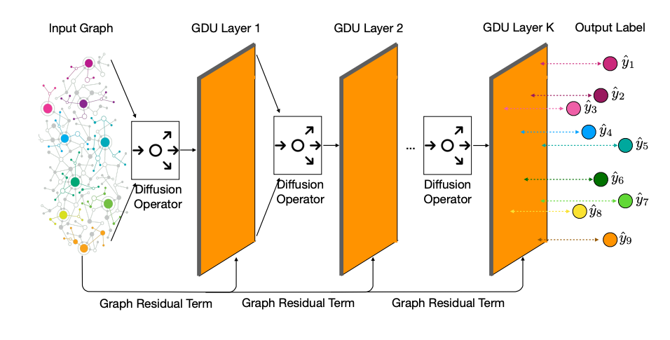
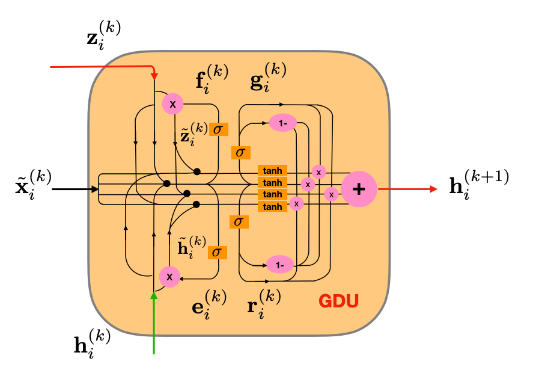

# DifNet



## Deep Diffusive Neural Network on Graph Semi-Supervised Classification

Source code of "Get Rid of Suspended Animation Problem: Deep Diffusive Neural Network on Graph Semi-Supervised Classification". </br>
Paper arXiv URL: https://arxiv.org/abs/2001.07922

### Two other papers are helpful for readers to follow the ideas in this paper and the code

(1) FAKEDETECTOR: Effective Fake News Detection with Deep Diffusive Neural Network https://arxiv.org/abs/1805.08751

(2) Graph Neural Lasso for Dynamic Network Regression https://arxiv.org/abs/1907.11114

### References

```
@article{Zhang2020GetRO,
  title={Get Rid of Suspended Animation Problem: Deep Diffusive Neural Network on Graph Semi-Supervised Classification},
  author={Jiawei Zhang},
  journal={ArXiv},
  year={2020},
  volume={abs/2001.07922}
}
```

************************************************************************************************

## How to run the code?

### To run a script, you can just use command line: python3 script_name.py

After downloading the code, you can run
```
python3 script.py
```
directly for node classification on Cora dataset.

### How to turn on/off the blocks?

You can change the "if 0" to "if 1" to turn on a script block, and the reverse to turn off a script block.

### Several toolkits may be needed to run the code
(1) pytorch (https://anaconda.org/pytorch/pytorch)
(2) sklearn (https://anaconda.org/anaconda/scikit-learn) 
(3) transformers (https://anaconda.org/conda-forge/transformers) 

************************************************************************************************

## Organization of the code?

A simpler template of the code is also available at http://www.ifmlab.org/files/template/IFM_Lab_Program_Template_Python3.zip

### The whole program is divided into five main parts:

(1) data.py (for data loading and basic data organization operators, defines abstract method load() )

(2) method.py (for complex operations on the data, defines abstract method run() )

(3) result.py (for saving/loading results from files, defines abstract method load() and save() )

(4) evaluate.py (for result evaluation, defines abstract method evaluate() )

(5) setting.py (for experiment settings, defines abstract method load_run_save_evaluate() )

The base class of these five parts are defined in ./code/base_class/, they are all abstract class defining the templates and architecture of the code.

The inherited class are provided in ./code, which inherit from the base classes, implement the abstract methonds.


## Detailed information on funtional classes?

### a. data

(1) DatasetLoader.py (for dataset loading)


### b. method

(1) cellGDU.py (defines the GDU neuron, we also include several simplified version of GDU in this class)

(2) MethodDifNet.py (the DifNet model for node classification)


### c. result

(1) ResultSaving.py (for saving results to file)


### d. evaluate

(1) EvaluateAcc.py (accuracy metric)


### e. setting

(1) Settings.py (defines the interactions and data exchange among the above classes)


************************************************************************************************

## GDU Neuron



In ./code/cellGDU.py , we provide the implementation of several different versions of GDU.

(1) gdu_type == 'original': the GDU introduced in the paper. It introduces two neural gates f and e for state updating, and two other neural gates g and r for output selection.

(2) gdu_type == 'short_gate': a simplified version of GDU. It also uses the same number of gates for state updating and output selection. The main simplification is on the output, which selects output about h and z, whereas x is a fixed output.

(3) gdu_type == 'single_gate': a simplified version of GDU. It uses two neural gates f and e for state updating, but only uses one single gate for output selection. It is also introduced in the paper as a simplified version of GDU.

(4) gdu_type == 'recombine': a simplified version of GDU. It further simplify the "short_gate" GDU in the output to be selected.


